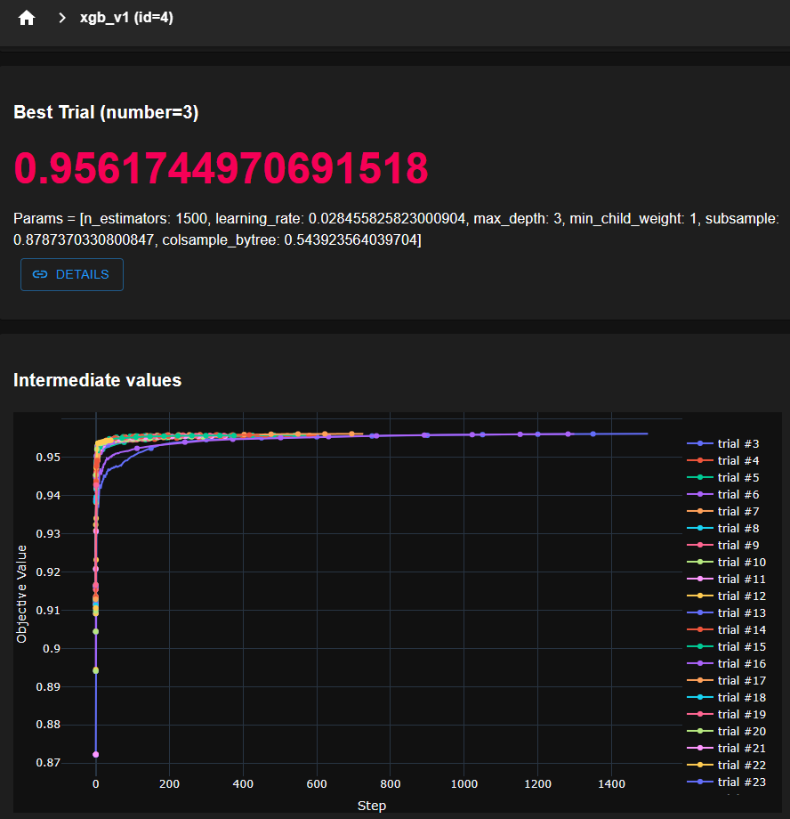
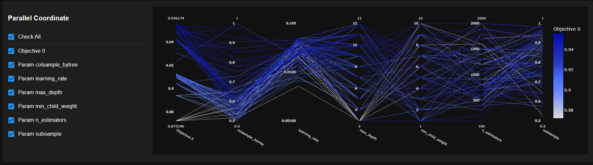
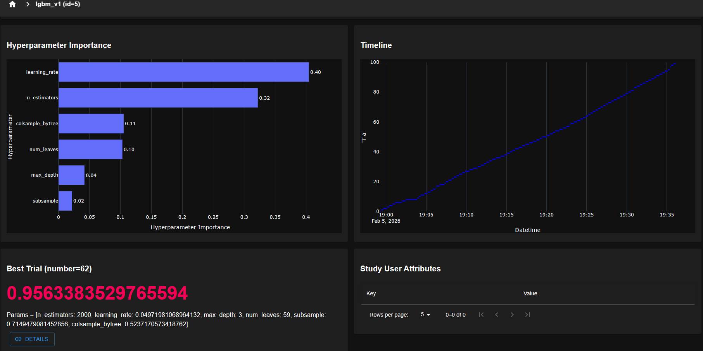
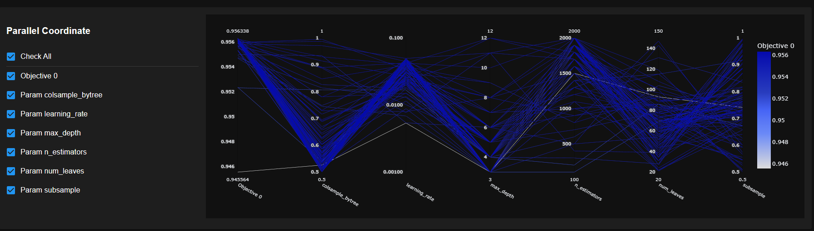

# Kaggle Submissions

### 1. playground-series-s6e2 : Predicting_Heart_Disease

- Data : https://www.kaggle.com/competitions/playground-series-s6e2/data
- Using XGBoost & LightGBM to predict heart disease
- Also using Optuna for hyperparameter optimization
- Using Optuna-Dashboard for visualization of optimization process
- 
- 
- 
- 
